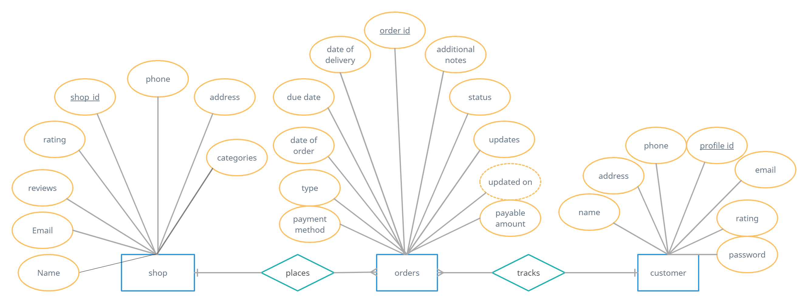

# B.I.T.I - Bag It, Tag It

Website Link
------
[Link to Deployed Webiste](https://b-i-t-i.onrender.com)

ERD Diagram
------

[Link to ERD](https://app.creately.com/d/8cRDfNW4iAN/view)

Relational Schema
------

Template link
------
[Link to dashboard template](https://github.com/startbootstrap/startbootstrap-sb-admin-2)

Dependencies Used
------
* ChartJS - Generate Graphs and Charts
* bcryptjs - To hash passwords
* mongoose - Connect to MongoDB
* express-session - To store session data
* json2csv - generate CSVs
* nodemailer - Sending Mails
* passport - Google OAuth
* Bootstrap - Create Responsive Web Designs

Left to Do
------
- [ ] Implement a Search bar
- [ ] Add Forgot Password

